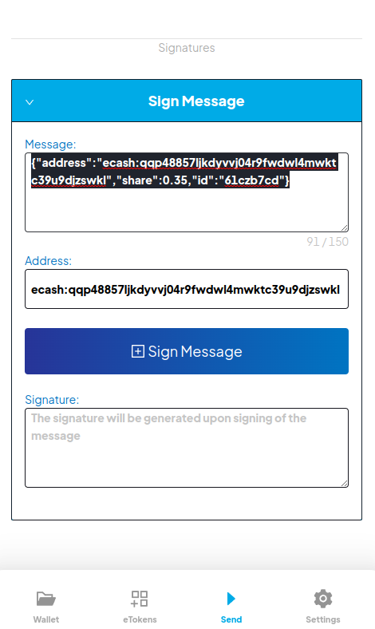
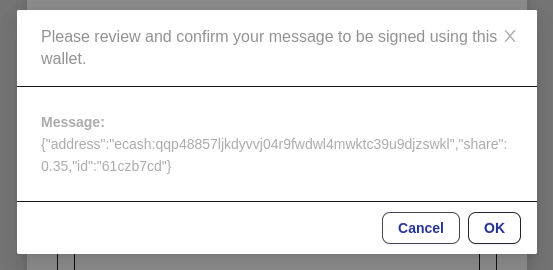
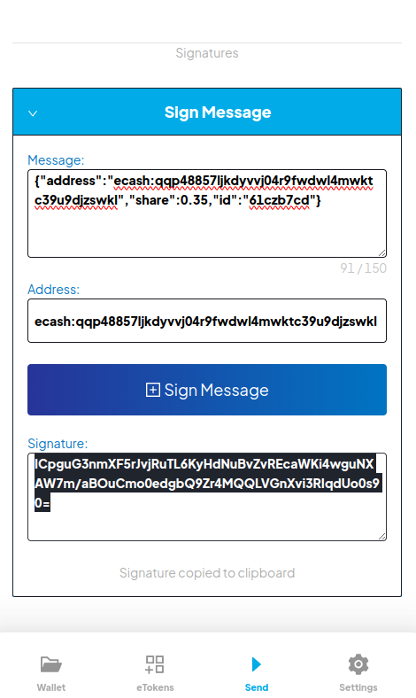

# Using Certificates for the CMPCT Payment Server

## What is a Certificate?
A Payment Certificate is a document according to the [DID Protocol](https://github.com/hansekontor/did-protocol) that provides a template for creating recurring payments via a BIP70 payment server. The certificate contains pro-rata amounts for each non-fee output that are used to create an absolute distribution of token outputs. A verifiable proof of the certificate is broadcasted to the eCash blockchain. 

## Getting a Certificate
1. Ordering a Certificate. Our payment certificate implies a BIP70 fee of 5% of the requested amount. Therefore, certificates only list recipients and shares for 95% of the requested amount. Ordering a certificate requires an email from one of the recipients to info@cert.cash specifying a list of addresses and shares for the certificate. The example below contains all the relevant data.
```
ecash:qpguf78k4rllxnar7fwy0rm9cjm77mlh4uneueus2c 60%
ecash:qqp48857ljkdyvvj04r9fwdwl4mwktc39u9djzswkl 35%
```
2. Signing the Certiciate. Prior to the official issuance of the certificate, all participants sign their share and certificate via a digital signature in a wallet. The messages to sign are sent to the email used to order the certificate. Following the example above, the message to sign for the second output could be:
```
{"address":"ecash:qqp48857ljkdyvvj04r9fwdwl4mwktc39u9djzswkl","share":0.35,"id":"61czb7cd"}
```
The id specifies the whole certificate order additionally to address and share. Via the given id, the whole certificate can be seen at [cert.cash](https://cert.cash/certs/search). The controller of the address needs to sign this message with the according private key with the signing function of [Cashtab](https://wallet.badger.cash/). On the "Send" tab scroll down and click on "Sign Message". Copy your message into the empty "Message" field, click on the dark blue "Sign Message" button and confirm with "OK". Copy and store the given signature.







3. Confirming the Certificate. With the same email used for ordering, send all signatures to info@cert.cash. If all signatures are valid, the certificate will be broadcasted and an email notification will be send with the transaction hash of the on-chain document. This hash has to be used when requesting payments.


## Using a Certificate
Request payments via "https://pay.cmpct.org/template" according to [BUX.digital Payment Protocol Merchant Server](https://github.com/bux-digital/documentation/blob/main/merchant-server-api.md). Instead of `merchant_addr`, the request uses the `cert_hash` property containg the created certificate's hash. 
