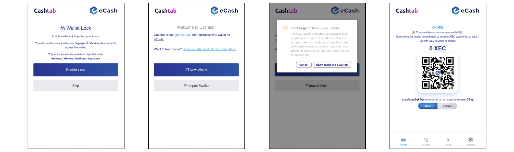
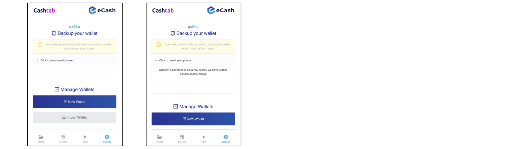
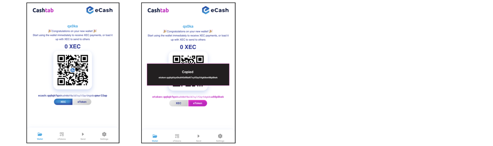

# CMPCT Developer Guide
A solution for trustless Multi-Recipient Payments using the [BUX.digital Payment Protocol Merchant Server](https://github.com/bux-digital/documentation/blob/main/merchant-server-api.md).


### NOTICE FOR THE USE OF THIS SERVICE
The transactions created over the CMPCT API use the Badger Universal Token (BUX) which is an eToken on the eCash blockchain. During the initial acquisation of BUX, an authorization code must be bought by the End User - while this purchase can be refunded (minus fee), the minting of BUX with that authorization code is irreversible regardless of whether BUX were actually used for a purchase! It is highly recommended that Agents inform their End Users about the nature of this payment method. Agents should take measures to validate the transaction before approving the purchase (see Section 2.5).

## 1 Using Your Wallet
### 1.1 Setup Your Wallet
Visit https://wallet.bader.cash to setup your wallet.
1. Click Enable Lock to enable access control or skip
2. Click New Wallet to create a new wallet
3. NOTE: You will backup your wallet in later steps
4. Your new wallet is now ready to receive BUX



### 1.2 Backup Your Wallet
Your seed phrase is the only way to restore your wallet. Write it down. Keep it safe. No one else is able to restore your wallet. Here is an overview on seed phrases and recommendations for safe storage: https://www.coinbase.com/learn/crypto-basics/what-is-a-seed-phrase
1. Click 'Settings' to access your wallet settings
2. Click 'Click to review seed phrase' to display your seed phrase



### 1.3 Provide Your Address
Your wallet address provides the details for other people to send you BUX, similar to your email address. Your address is safe to share as it does not provide access to your wallet.
You will need to provide your wallet address to be included in a CMPCT.
1. Click Wallet to display your wallet details
2. Click XEC, then your ecash address to copy

NOTE: While wallet addresses with both the `ecash` or `etoken` prefix will function interchangeably in a CMPCT, for simplicity using `ecash` is recommended.



### 1.4 Manage Multiple Wallets
You can easily have multiple, separate wallets.
1. Click Settings then click New Wallet to create a new wallet
2. Toggle Saved wallets to display all of your wallets
3. Click the Edit icon to set a nickname for each wallet


## 2 Payment Solution Flow
1. End User chooses relevant method or uses direct payment link
2. Agent's server sends GET request containing the transaction details to CMPCT API
3. CMPCT API returns `paymentUrl` that leads the End User to a non-custodial web wallet with prefilled transaction data
4. End User pays inside the wallet and, on success, is led to `success_url`
5. Agent receives Instant Payment Notification (IPN) and validates the IPN before approving the purchase

### 2.1 End User Chooses Payment Option
Agents are able to flexibly utilize the CMPCT solution to provide End Users with the relevant payment option. For example, this can be done similar to legacy payment options (which can be maintained unchanged in parallel). Agents, affiliates, and others can also create direct payment links, such as buttons on a website or links in an email or text message. Agents are encouraged to inform End Users of the nature of this payment method.

### 2.2 Agent's Server Sends GET request
A GET request is made to `https://pay.cmpct.org/v1/`. The query string must follow the exact syntax as specified in the [documentation of the BUX.digital Merchant Server](https://github.com/bux-digital/documentation/blob/main/merchant-server-api.md). Agents must gather wallet address(es) from Recipient(s), to which the distribution of BUX will be sent directly from the End User with every transaction. 

### 2.3 CMPCT API Returns `paymentUrl`
The CMPCT API responds with the same syntax as specified in the [BUX.digital documentation](https://github.com/bux-digital/documentation/blob/main/merchant-server-api.md). The Agent can either make the GET request to the CMPCT API and receive the `paymentUrl` as part of a JSON response or, while not specifying the `result_JSON` parameter, let the End User make the GET request by opening the link in a browser.  

### 2.4 End User pays Inside wallet
The End User will be redirected to a non-custodial web wallet, which will be newly opened if the End User did not previously create one using this browser session. As `paymentUrl` has been used, the related transaction data will be prefilled into the wallet. The End User, having an insufficient amount of BUX inside their wallet, will be directed to buy an authorization code to Self-Mint the eTokens directly inside the wallet. This purchase is done by conventional payment methods. After the succesful Self-Mint by the End User, the BUX eTokens can be used in order to settle the payment request. It is possible that the End User utilizes previously minted BUX.

### 2.5 Agent Receives IPN and Validates IPN
Following the successful fullfillment of a payment request, an IPN is sent to the URL specified in the `ipn_url` of the initial GET request. This request must be validated by the Agent. Several stages of validation are possible, dependent on the involved risk of the Agent. The recommended stages of validation are as following:
1. validate IP address, existence of transaction and order key
2. validate the transaction outputs

#### 2.5.1 validate IP address, existence of transaction and invoice
Make sure that the origin of the IPN matches the origin of  `paymentUrl` (`https://pay.badger.cash/`). The IPN contains a transaction id, `txn_id`, of the broadcasted transaction. This id allows anyone to verify the existence and contents of this transaction by asking a node (see below). Agents should also check whether the IPN truly matches an open order. Due to the public nature of the blockchain it would be possible to attack the Agent's IPN server with previously used or old, but still valid, transactions. A validation procedure of highest security level would therefore include a comparison between a new `txn_id` and all previously accepted `txn_id`.

```javascript
const axios = require('axios');

async function postIpn(req, res) {
    const ipn = req.body;
    
    
    // validate ip address
    const ipAddress = req.socket.remoteAddress;
    // compare... 


    // validate existence of transaction
    const url = `https://ecash.badger.cash:8332/tx/${ipn.txn_id}?slp=true`;
    const result = await axios.get(url);
    const txData = result.data;


    // validate that transaction settles new order
    const orderKey = ipn.custom; 
    // compare payment status of order in Agent database...

}
```
If the transaction is existent on the blockchain, `txdata` as defined above will look like this: 
```
{
  hash: 'c403e286094c5f236cf27db31ca26a8e038d708ec71f4aa803931cefcdcfa7e4',
  fee: 444,
  rate: 1047,
  mtime: 1670507577,
  height: 769485,
  block: '000000000000000005a5fff31193b30dcfcffd2125e0d380d57c911f439d56c4',
  time: 1670505744,
  index: 18,
  version: 1,
  inputs: [
    {
      prevout: [Object],
      script: '419033c3cc6ad8a3d90d80f012d11a78c197c458c7d95a52cdc8965fb0de119e0f53f105334ce3771e8b8c998525369e572aae3924f5bfd11873280b32efe24aba412102033df0bcf94dea5bb838eb1187e3b748755a5b87b3feeb16e2eaa6a5b3bbd43c',
      sequence: 4294967295,
      coin: [Object]
    },
    {
      prevout: [Object],
      script: '4184366b1e79947d6d3b253407fc2b28ab2137fdce2add73e2d4db8cb634332c62ee55577bccec31e232ae0d2ef0a9b7702c000e9576c098f7d7f210392d4620c9412102033df0bcf94dea5bb838eb1187e3b748755a5b87b3feeb16e2eaa6a5b3bbd43c',
      sequence: 4294967295,
      coin: [Object]
    }
  ],
  outputs: [
    {
      value: 0,
      script: '6a04534c500001010453454e44207e7dacd72dcdb14e00a03dd3aff47f019ed51a6f1f4e4f532ae50692f62bc4e508000000000000c350',
      address: null
    },
    {
      value: 546,
      script: '76a9142c7467c77f5904d6bbbac74e3f81fc13deee5f0d88ac',
      address: 'ecash:qqk8ge780avsf44mhtr5u0uplsfaamjlp5l96rstgd',
      slp: [Object]
    },
    {
      value: 7254,
      script: '76a91414fe24d118defcc8ba37559439081cbcaafa0b3088ac',
      address: 'ecash:qq20ufx3rr00ej96xa2egwggrj7247stxq0awklt2w'
    }
  ],
  locktime: 0,
  hex: '01000000027f85726d8ef49ca0afa9c3acc41de7b17dae4aea2c5fd328941e07fb233900650100000064419033c3cc6ad8a3d90d80f012d11a78c197c458c7d95a52cdc8965fb0de119e0f53f105334ce3771e8b8c998525369e572aae3924f5bfd11873280b32efe24aba412102033df0bcf94dea5bb838eb1187e3b748755a5b87b3feeb16e2eaa6a5b3bbd43cffffffff5a1aea7995a7c322f3e143a30ca094198f06445344fc9008878c8d6512c4269602000000644184366b1e79947d6d3b253407fc2b28ab2137fdce2add73e2d4db8cb634332c62ee55577bccec31e232ae0d2ef0a9b7702c000e9576c098f7d7f210392d4620c9412102033df0bcf94dea5bb838eb1187e3b748755a5b87b3feeb16e2eaa6a5b3bbd43cffffffff030000000000000000376a04534c500001010453454e44207e7dacd72dcdb14e00a03dd3aff47f019ed51a6f1f4e4f532ae50692f62bc4e508000000000000c35022020000000000001976a9142c7467c77f5904d6bbbac74e3f81fc13deee5f0d88ac561c0000000000001976a91414fe24d118defcc8ba37559439081cbcaafa0b3088ac00000000',
  slpToken: {
    tokenId: '7e7dacd72dcdb14e00a03dd3aff47f019ed51a6f1f4e4f532ae50692f62bc4e5',
    ticker: 'BUX',
    name: 'Badger Universal Token',
    uri: 'https://bux.digital',
    hash: '',
    decimals: 4
  },
  confirmations: 2
}
```


#### 2.5.2 Validate Transaction Outputs
If Agents have already validated the IP address, concerns that another token than BUX would have been used are minor. Still, this remains an optional validation which is included in the code sample below. Inside `txData`, it is possible to validate the exact amounts for each Recipient specified by the GET request in Section 2.2. Based on  `order_key` or `offer_name`, Agents can call their database to see which query strings they've used and therefore expect to be existent in the transaction outputs. Since addresses in the outputs might not be in the format that Agents use in their GET request (varying prefixes `ecash`/`etoken`), down below will be an example of converting ecash addresses into the desired format. If this additional dependency is undesired, Agents should use addresses with the `ecash` prefix to make the GET request of Section 2.2 as they will confidently be provided by every node. Agents must certainly validate the transaction outputs if they build the GET request as a static standalone payment link.

```javascript 
const ecashaddr = require('ecashaddrjs');

const outputs = txData.outputs;
const buxTokenId = "7e7dacd72dcdb14e00a03dd3aff47f019ed51a6f1f4e4f532ae50692f62bc4e5";
const buxDecimals = 4;
const isBuxTransaction = txData.slpToken.tokenId === buxTokenId;

let recipientArray = [];  
if (isBuxTransaction) {
    for (let i = 1; i < outputs.length; i++) {
        const isSlpOutput = outputs[i].slp;
        if (isSlpOutput) {  
            const buxAmount = +(outputs[i].slp.value) / 10**buxDecimals;
            recipientArray.push({
                address: convertAddress(outputs[i].address, "etoken"),
                buxAmount: buxAmount
            });
        }
    }
}


// function returns address with desired prefix
function convertAddress(address, targetPrefix) {
    const { prefix, type, hash } = ecashaddr.decode(address);
    if (prefix === targetPrefix) {
        return address;
    } else {
        const convertedAddress = ecashaddr.encode(targetPrefix, type, hash);
        return convertedAddress;
    }
};
```
The resulting `recipientArray` will contain all addresses of BUX recipients accompanied by their respective amounts (see below). These should now be compared to the expected results. Please be aware that the additional fees by the network will be included in this array as well as possible change back to the sender. Therefore, it should only be tested if expected addresses/amounts are contained in the transaction ouputs, allowing additional Recipients to exist as well. If addresses and amounts are as expected, the purchase can be approved.
```
[
  {
    address: 'etoken:qqk8ge780avsf44mhtr5u0uplsfaamjlp53mnpxvv6',
    buxAmount: 5
  }
]
```
